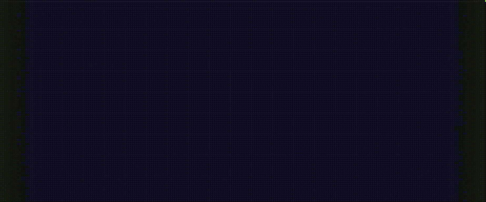

# Fabian's personal portfolio site, hosted at pilot-572.github.io

## What it is

A single page portfolio site built as one HTML file with all styles and scripts written inline. No framework, no build step. Tailwind CSS loads from a CDN. Fonts are Space Mono and DM Sans from Google Fonts. The whole thing is dark themed with a chartreuse green accent.

The page has six sections: a hero, an about section with a photo and stats, a projects grid, an achievements section, a Chartreuse brand section, a skills list, and a contact section.

The projects grid shows eight cards. Four of them have photos or videos that open in a modal with a slideshow. One card is a featured full width card for the homelab project. The BeamNG edits card plays a video preview on hover and opens a full video carousel. Cards without photos open a text only modal.

There is a custom cursor made of a dot and a trailing ring. It switches automatically between the custom cursor and the native cursor depending on whether you are using a mouse or a touchscreen.
